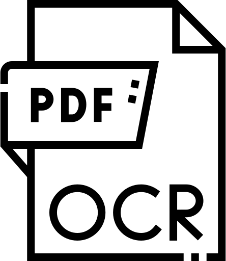

#  macOCR
*OCR, but on a Mac!*
## About
This app is a wrapper for the [https://github.com/ocrmypdf/OCRmyPDF](OCRmyPDF) command line interface, which itself is built on the Tesseract engine for optical character recognition (OCR) of PDFs built from un-processed images.  It is designed in particular to make it easy and simple for users not habituated to the command line to OCR documents on a Mac.
## Dependencies
This application requires both OCRMyPDF and Tesseract. Homebrew users can install these simply by using the following code:
> brew install ocrmypdf; brew install tesseract
Users will have to determine which languages are needed for there work; to install all languages, the code below works:
> brew install tesseract-lang
For users who are uncomfortable or unhabitauted to the command line, I have bundled a small application called 'Dependency Installer', which will install (in the event these are not already installed): Homebrew, Tesseract, OCRmyPDF, and Tesseract-Lang.  The final installation will take up a non-trivial large amount of space (~500mb), so please be aware of this when choosing to use the automated installation!  
## Usage
Simply drag a PDF in need of a good OCR and put it on the app! Then, select the language to be used, by typing the Tesseract language codes (eng, fre, deu, etc); [a complete list of the language codes is available at this link].  The default code is set to 'eng,', so English-only users can simply press 'return'. Then, simply wait as the PDF is outputted.
## Note
For the sake of simplicity (I wanted this usage to be as incredibly easy as possible), I have dictated that this app will, first, force OCR on all pages, including those with existing text; this is because skipping such pages would miss the point for use cases involving poorly OCRed texts needing a redo, and frankly, adding addittional options would be more coding than I was prepared to do.  It will also always output documents conforming to the PDF/A standard (this is good, mostly!).
## Licence
This is free and open-source software, licensed under the MIT licence.  Users may use it as they please.
